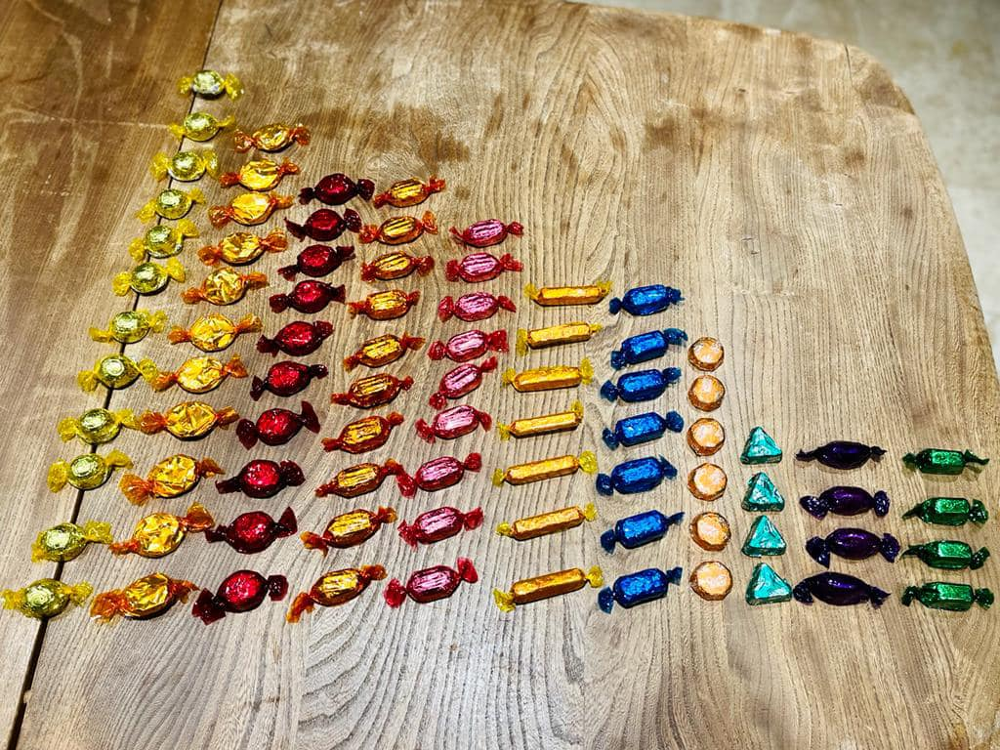
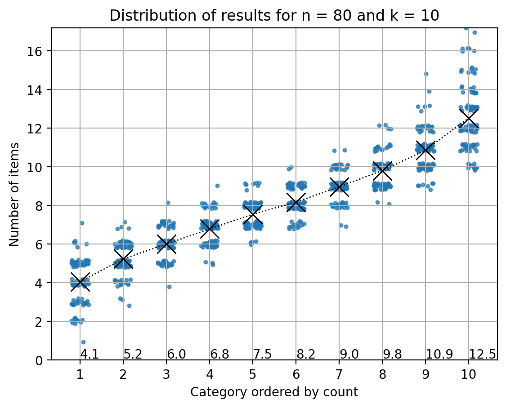

# Quality Street Problem

## Introduction
This is inspired by a post I saw on Facebook where people seemed concerned that there was an uneven distribution of sweets in packets of Quality street as in the image below:

This is quite interesting, since you might expect an equal number of each, right?

However, it's obvious that if you select at random from an equal probability, it is highly unlikely that the outcome is equal. Why? Because there are many more ways to select for an uneven distribution than for an even one. Okay, that is easy enough, but what should you expect and how would you check if the distribution is really random or not?  Lets formalize these questions more clearly:

Suppose the total number of sweets is N, the number of types is K, and the probablity of selecting a given type (or category) *i* at each draw is $$p_i = 1/K$$

#### Q: What is the most likely distribution of numbers of sweets after re-ordering accorging the number in each category?

### Theory
We can denote a specific outcome as
$$X = (x_1, x_2, \cdots, x_K)$$
where $$x_i$$ is the number of sweets in category *i* after selecting *N* at random.  The reordered outcome is
$$Y = sort(X)$$

The underlying probablility distribution for *X* is multinomial, but with the added complication of re-ordering the categories according to size which changes the expectation value from N/K for each element of *X* to something more complicated.
One way of solving this is by simulation. 

This is a typical result:

You can play around with the parameters using the web app below: 

### [Launch web App](https://mysterious-falls-98860.herokuapp.com/)

The code for the app is here: [Github code](https://github.com/stuarthaze/Quality_Street)