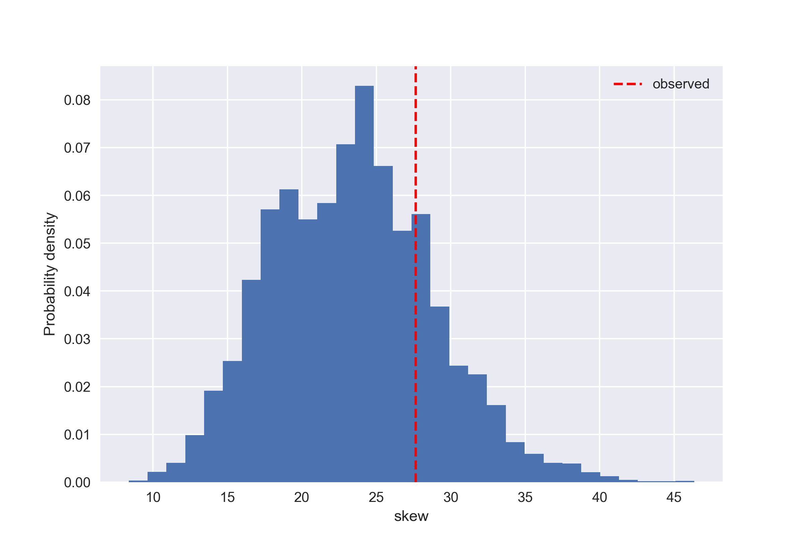

<script src="https://cdn.mathjax.org/mathjax/latest/MathJax.js?config=TeX-AMS-MML_HTMLorMML" type="text/javascript"></script>

# Quality Street Problem

## Introduction
This is inspired by a post I saw on Facebook where people seemed concerned that there was an uneven distribution of sweets in packets of Quality street as in the image below:


This is quite interesting, since you might expect an equal number of each, right?

However, it's obvious that if you select at random from an equal probability, it is highly unlikely that the outcome is equal. Why? Because there are many more ways to select for an uneven distribution than for an even one. Okay, that is easy enough, but what should you expect and how would you check if the distribution is really random or not?  


## Q1: What is the most likely distribution of numbers of sweets after re-ordering accorging the number in each category?

### Theory
Suppose the total number of sweets is *N*, the number of types is *K*, and the probablity of selecting a given type (or category) *i* at each draw is 
$$p_i = 1/K$$

We can denote a specific outcome as
$$X = (x_1, x_2, \cdots, x_K)$$
where $$x_i$$ is the number of sweets in category *i* after selecting *N* at random.  The reordered outcome is
$$Y = sort(X)$$

The underlying probablility distribution for *X* is multinomial, but to solve the problem we have the added complication of re-ordering the categories according to size. While the expectation values of *X* are all *N/K*, the expectation values of *Y* are more complicated.
One way of finding an approximate solution is by simulation with repeated random draws. This is a typical result:  


I created a web app to demonstrate this, which performs the simulation for *t* trials and averages the results to estimate the most likely outcome for *Y*:

### [Launch web App](https://mysterious-falls-98860.herokuapp.com/)
Note: This maybe taked offline soon, due to a change in policy at heroku, but the app itself can also be launched at the teminal (requires streamilt):

```
$ streamlit run app.py
```

The code for the app is here: [Github code](https://github.com/stuarthaze/Quality_Street)

I'm curious if there is an analytic solution to this problem. Please leave a note on the repository page if you find one!

## Q2: Given this specific distribution, is it likely that it was drawn from a uniform probability distribution?

I have looked at this question in more detail in the jupyter notebook: `sweet_hypothesis_test.ipynb`.  

In summary, I defined a skew test statistic as the sum of absolute deviations from the mean expectation value for each category. Simulating the multinomial distribution produced the following histogram, and a p-value of 0.2, which is too large to reject the null hypothesis that the example originated from a uniform probablility distribution with reasonable confidence.

